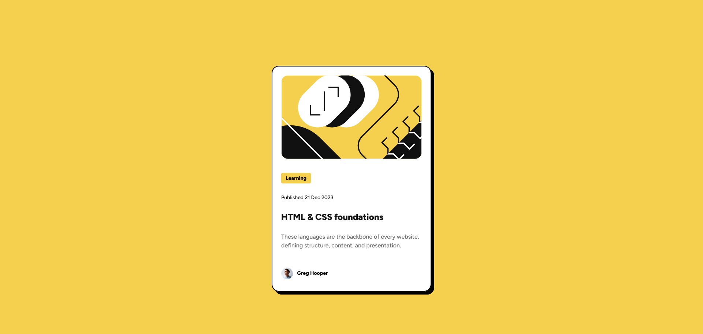
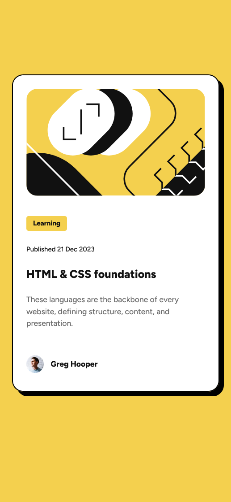

# Frontend Mentor - Blog preview card solution

This is a solution to the [Blog preview card challenge on Frontend Mentor](https://www.frontendmentor.io/challenges/blog-preview-card-ckPaj01IcS). Frontend Mentor challenges help you improve your coding skills by building realistic projects. 

## Table of contents

- [Overview](#overview)
  - [The challenge](#the-challenge)
  - [Screenshot](#screenshot)
  - [Links](#links)
- [My process](#my-process)
  - [Built with](#built-with)
  - [What I learned](#what-i-learned)
  - [Continued development](#continued-development)
  - [Useful resources](#useful-resources)
- [Author](#author)
- [Acknowledgments](#acknowledgments)

## Overview

### The challenge

Users should be able to:

- See hover and focus states for all interactive elements on the page

### Screenshot
<div style="display:flex; flex-direction: column; gap: 2rem; align-items: center;">
  
  
</div>

### Links

- Solution URL: [GitHub Repo](https://github.com/prem-03829/Blog-preview-card)
- Live Site URL: [Vercel link](https://blog-preview-card-one-mu.vercel.app/)

## My process

### Built with

- Semantic HTML5 markup
- CSS custom properties
- Flexbox
- Mobile-first workflow
- REM-based breakpoints

### What I learned

- Creating a responsive UI with a mobile-first approach
- Using design tokens effectively (--fs, --p, --br, --bs)
- Handling hover states only on desktop screens
- Understanding breakpoints in REM for better scalability
- Writing clean, maintainable CSS
- This allows hover effects to work only on large screens, correct UX for mobile.
```css
@media (min-width: 90rem) {
  .card:hover {
    box-shadow: var(--bs-md);
    cursor: pointer;
  }

  .card:hover .title {
    color: var(--yellow);
  }
}
```

### Continued development

- Going forward, I want to improve:
- Sharper design token organization
- More reusable card components
- Better accessibility (focus states, ARIA, etc.)
- Dark mode versions of components

### Useful resources

- [HTML & CSS course](https://youtu.be/G3e-cpL7ofc?si=7YR5vK1qGlj99kkb) - A great beginner-friendly introduction to HTML and CSS. It helped reinforce core concepts I used in this challenge.

## Author

- LinkedIn - [Prem Paramanick](https://www.linkedin.com/in/prem-paramanick-a46205338)
- Frontend Mentor - [@prem-03829](https://www.frontendmentor.io/profile/prem-03829)
- GitHub - [@prem-03829](https://github.com/prem-03829)

## Acknowledgments

Huge thanks to Frontend Mentor for the challenge.  
It pushed me to refine my CSS, understand responsive breakpoints better, and write cleaner, reusable code.
